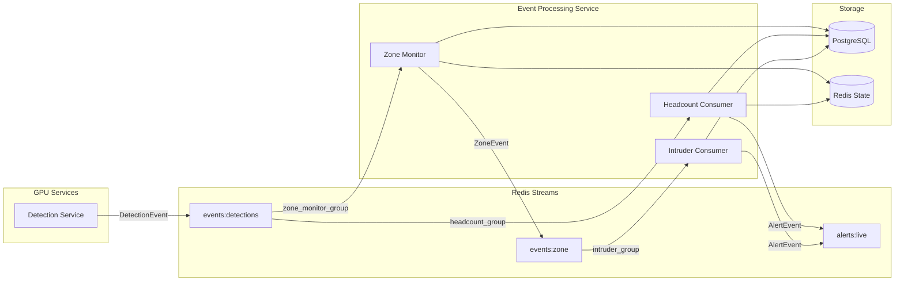
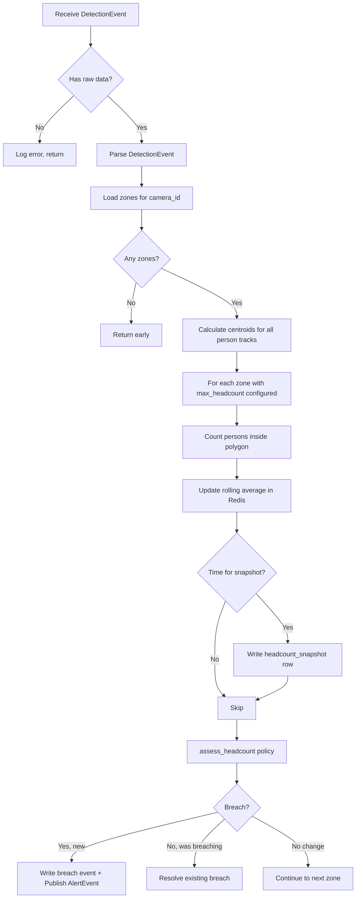

# Headcount Monitoring & Intruder Detection — Implementation Document

> **Scope:** Sprint 4 — Event Processing Workers  
> **Services Affected:** `event_processing`, `shared`  
> **Date:** 2026-09-27  

---

## 1. Executive Summary

This implementation adds **Headcount Monitoring** as an entirely new capability and strengthens the existing **Intruder Detection** worker with fixes that close gaps in its original implementation. Both features follow the established event-driven architecture — consuming from Redis Streams, applying pure-function policy logic, persisting state to PostgreSQL, and publishing alerts to the `alerts:live` stream.

**What shipped:**

| Feature | Type | Summary |
|---|---|---|
| Headcount Monitoring | New | Counts persons per zone per frame, maintains a 30-second rolling average, writes periodic snapshots to PostgreSQL, and fires threshold-breach alerts |
| Intruder Detection — `frame_reference` fix | Improvement | Alerts now carry the actual frame reference instead of `None`, enabling the API/dashboard to show evidence frames |
| Intruder Detection — Dwell-based classification | Improvement | Unknown persons who dwell past the zone threshold in a restricted zone now correctly trigger intruder alerts, not just on initial entry |
| Schema evolution — `ZoneEvent` & `AlertEvent` | Improvement | Added `frame_reference` to `ZoneEvent` and `frame_provider` to `AlertEvent`, completing the data lineage from detection through to alert |

**Nothing was broken.** All new schema fields are `Optional` with defaults. Existing tests, consumers, and API code continue to work without modification.

---

## 2. Architecture — How It All Fits

### System Data Flow



### Key Architectural Principle

Every consumer in `event_processing` follows the same pattern:

```
Redis Stream → BaseStreamConsumer → process() → Policy (pure function) → Store (DB/Redis) → Alert (publish)
```

The Headcount Consumer follows this pattern exactly. It does **not** call other services via HTTP, does **not** import from other workers' consumers, and does **not** share mutable state across workers. The only shared resources are:

1. **`ZoneStore`** — reused (not reimplemented) from the zone monitor for loading zone configurations. This is a read-only data accessor with its own L1/L2 cache, safe for concurrent use.
2. **`zone_policy.py`** — reused `get_centroid()` and `point_in_polygon()` functions. These are pure, stateless functions.

---

## 3. New Files — Complete Walkthrough

### 3.1 Database Migration — [`0005_headcount.py`](migrations/versions/0005_headcount.py)

**Purpose:** Creates the two tables the headcount worker needs to persist its state.

**Merge Head:** This migration has `down_revision = ("0004_intruder", "0004")` because the Alembic history has two `0004` heads — one for the intruder tables and one for the `refined_face_bbox` column. This migration acts as a merge point, collapsing them back into a single linear history.

#### Table: `headcount_snapshots`

| Column | Type | Purpose |
|---|---|---|
| `id` | UUID PK | Auto-generated |
| `camera_id` | UUID | Which camera |
| `zone_id` | UUID | Which zone |
| `count` | INTEGER | Instantaneous person count at time of snapshot |
| `rolling_avg` | FLOAT | 30-second rolling average at time of snapshot |
| `timestamp` | TIMESTAMPTZ | When this snapshot was taken |
| `created_at` | TIMESTAMPTZ | DB insertion time |

**Indexes:** `(camera_id, timestamp)` and `(zone_id, timestamp)` — optimized for the two most common query patterns: "show me headcount over time for this camera" and "show me headcount over time for this zone."

**Write frequency:** One row per zone every ~5 seconds (throttled, not per-frame). At 10 zones and 5-second intervals, this is ~172,800 rows/day — manageable with the composite indexes.

#### Table: `headcount_breach_events`

| Column | Type | Purpose |
|---|---|---|
| `id` | UUID PK | Auto-generated |
| `zone_id` | UUID | Breached zone |
| `camera_id` | UUID | Camera observing the zone |
| `count` | INTEGER | Person count at time of breach |
| `threshold` | INTEGER | Configured max headcount for the zone |
| `alert_status` | VARCHAR(32) | `pending` → `acknowledged` → `resolved` |
| `timestamp` | TIMESTAMPTZ | When the breach was detected |
| `resolved_at` | TIMESTAMPTZ | When headcount dropped back below threshold |

**Design choice:** `alert_status` uses `VARCHAR(32)` instead of a PostgreSQL `ENUM` type, matching the pattern used throughout the existing codebase (e.g. `zone_events.event_type` is also `VARCHAR(32)`). This avoids the operational complexity of altering PostgreSQL enums during future migrations.

---

### 3.2 Headcount Policy — [`headcount_policy.py`](services/event_processing/src/policies/headcount_policy.py)

```python
def assess_headcount(zone_id, zone_name, count, max_headcount) -> HeadcountAssessment | None
```

**Why it's a separate file:** Following the project's established pattern where every classification or decision is a **pure function** in a policy file (see [`intruder_policy.py`](services/event_processing/src/policies/intruder_policy.py), [`zone_policy.py`](services/event_processing/src/policies/zone_policy.py)). This makes it trivially unit-testable without mocking Redis or PostgreSQL.

**Behavior:**
- Returns `None` if `max_headcount` is not configured for the zone → the consumer skips this zone entirely
- Returns a `HeadcountAssessment` with `is_breach = count > max_headcount` otherwise
- Uses strict greater-than (`>`), not greater-than-or-equal — being *at* the limit is OK, *exceeding* it is the breach

**Design choice — `frozen=True` dataclass:** The assessment is immutable once created. This prevents accidental mutation downstream and signals that the policy's output is a value, not a stateful object.

---

### 3.3 Headcount Config — [`headcount/config.py`](services/event_processing/src/workers/headcount/config.py)

Follows the exact same pattern as [`zone_monitor/config.py`](services/event_processing/src/workers/zone_monitor/config.py) — class-level attributes with `os.environ.get()` fallbacks.

**Key tuning parameters:**

| Parameter | Default | Purpose |
|---|---|---|
| `ROLLING_WINDOW_SECONDS` | 30 | How far back the rolling average looks |
| `SNAPSHOT_INTERVAL_SECONDS` | 5 | How often `headcount_snapshots` rows are written |
| `HEADCOUNT_CACHE_TTL` | 60 | Redis TTL on the rolling-window sorted set |
| `ALERTS_MAXLEN` | 10,000 | Max length of the `alerts:live` stream |

**Why `HEADCOUNT_CACHE_TTL = 60` when `ROLLING_WINDOW_SECONDS = 30`:** The TTL must be longer than the window so that entries don't expire before the `zremrangebyscore` cleanup runs. 60 seconds gives 2× headroom. If a camera goes offline, stale data self-evicts within a minute.

---

### 3.4 Headcount Store — [`headcount/headcount_store.py`](services/event_processing/src/workers/headcount/headcount_store.py)

The store encapsulates all Redis and PostgreSQL operations. The consumer never writes raw SQL or Redis commands directly — it only calls store methods.

#### Rolling Average — Redis Sorted Set

```
Key:    cache:headcount:{zone_id}:window
Member: "{count}:{uuid}"     ← uuid ensures uniqueness across same-count entries
Score:  unix timestamp       ← used for range-based eviction
```

The algorithm in `update_rolling_average()`:
1. `ZADD` the new count (with a UUID suffix to prevent deduplication of same counts)
2. `ZREMRANGEBYSCORE` to evict entries older than `ROLLING_WINDOW_SECONDS`
3. `ZRANGE 0 -1` to fetch all remaining entries
4. `EXPIRE` to set a TTL safety net
5. Sum up the counts and divide by entry count

All four commands execute in a single `MULTI/EXEC` pipeline — one round-trip to Redis.

**Why UUID suffix on the member key:** Redis sorted sets are maps — if two consecutive frames both have `count=5`, the second `ZADD` would overwrite the first (same member, different score). Appending a UUID makes each member unique while keeping the count parseable via `split(":")[0]`.

#### Snapshot Throttling — In-Memory Gate

`should_write_snapshot()` uses a simple in-memory `dict[zone_id, last_write_timestamp]`. This is deliberately not in Redis:
- It's per-worker state; if two headcount workers run, they each write snapshots at their own cadence — that's fine, it's just more data points
- It avoids a Redis round-trip on every single frame just to check a timer
- On restart, the first write always goes through (dict starts empty), which is correct behavior

#### PostgreSQL Operations

All DB writes use raw SQL via `sqlalchemy.text()` with parameterized queries, matching the exact same pattern as the zone monitor and intruder stores. UUIDs are cast with `CAST(:param AS uuid)` for PostgreSQL compatibility.

---

### 3.5 Headcount Consumer — [`headcount/consumer.py`](services/event_processing/src/workers/headcount/consumer.py)

This is the main worker. The `process()` method runs for every `DetectionEvent` consumed from the `events:detections` stream.

#### Processing Flow



#### Design Decision — Self-Contained Point-in-Polygon (Option A)

The headcount consumer recalculates `point_in_polygon` for every track against every zone, even though the Zone Monitor does the same thing for its own purposes.

**Why not just read the Zone Monitor's Redis track-state (Option B)?**

Both consumers belong to *different consumer groups* on the same `events:detections` stream. Redis delivers messages to consumer groups independently — there's no ordering guarantee between them. When the headcount worker processes `DetectionEvent #42`, the zone monitor may not have processed it yet. Reading `zone:track_state` keys at that point would give stale data from the *previous* frame.

Recalculating point-in-polygon is cheap (it's a simple ray-casting algorithm on 4–8 vertices), and it guarantees the headcount count is always consistent with the *current* frame's tracks. This is the correct trade-off for an event-driven system.

#### Breach Lifecycle

```
Count crosses above threshold  →  Write headcount_breach_event (status: pending)
                                   Publish AlertEvent to alerts:live
                                   
Count drops back below threshold →  UPDATE headcount_breach_event SET status = 'resolved'
                                    No new alert published (resolution is silent)
```

A new alert is only published when a breach *starts* — not on every frame while it's ongoing. The `get_open_breach()` check prevents alert spam.

---

### 3.6 Unit Tests — [`test_headcount_policy.py`](tests/services/event_processing/policies/test_headcount_policy.py)

Four test cases covering all branches of the policy:

| Test | Input | Expected |
|---|---|---|
| `test_no_threshold_returns_none` | `max_headcount=None` | Returns `None` (zone has no limit configured) |
| `test_under_threshold_no_breach` | count=5, threshold=10 | `is_breach=False` |
| `test_at_threshold_no_breach` | count=10, threshold=10 | `is_breach=False` (at limit is OK) |
| `test_over_threshold_is_breach` | count=11, threshold=10 | `is_breach=True`, verifies all fields |

---

## 4. Modified Files — What Changed and Why

### 4.1 [`shared/schemas/events.py`](shared/schemas/events.py) — Schema Evolution

Two fields added:

```diff
 class ZoneEvent(BaseModel):
     ...
     dwell_duration_seconds: Optional[float] = None
+    frame_reference: Optional[str] = None


 class AlertEvent(BaseModel):
     ...
     frame_reference: Optional[str] = None
+    frame_provider: Optional[FrameProvider] = None
     status: AlertStatus = AlertStatus.PENDING
```

**Why `frame_reference` on `ZoneEvent`:** The zone monitor has access to the `DetectionEvent.frame_reference` (the MinIO key or Redis key pointing to the actual frame image). Before this change, that reference was lost when the zone event was created — it was never passed through. The intruder consumer downstream needs it to attach evidence to alerts. Without it, the `AlertEvent.frame_reference` was hardcoded to `None`, making it impossible for the dashboard to show the frame that triggered an alert.

**Why `frame_provider` on `AlertEvent`:** The sprint specification defines the alert payload as carrying both `frame_reference` and `frame_provider`. Without `frame_provider`, the API consuming `alerts:live` doesn't know whether to fetch the frame from Redis or MinIO. Currently set to `None` since evidence snapshot capture (upload to MinIO) is a future sprint item, but the schema is now ready for it.

**Backward compatibility:** Both fields are `Optional` with `None` defaults. All existing code that creates `ZoneEvent` or `AlertEvent` without these fields continues to work. The existing test suite in [`test_schemas.py`](tests/shared/test_schemas.py) passes without modification — verified by reviewing all `make_zone()` and `make_alert()` helper invocations.

---

### 4.2 [`zone_monitor/consumer.py`](services/event_processing/src/workers/zone_monitor/consumer.py) — Pass Frame Reference Through

```diff
         zone_event = ZoneEvent(
             ...
             dwell_duration_seconds=transition.dwell_duration_seconds,
+            frame_reference=detection_event.frame_reference,
         )
```

One line. The `detection_event` already carries `frame_reference`; we just weren't forwarding it. The `ZoneEvent` is then serialized to JSON and published to `events:zone`, where the intruder consumer picks it up with the frame reference intact.

> [!NOTE]
> The zone_events database INSERT does **not** include `frame_reference` — it only stores the fields from the original migration schema. This is intentional: the frame reference is transient operational data needed by downstream consumers, not a durable analytical field. If needed later, a simple `ALTER TABLE zone_events ADD COLUMN frame_reference TEXT` would suffice.

---

### 4.3 [`intruder/consumer.py`](services/event_processing/src/workers/intruder/consumer.py) — Two Improvements

#### Improvement 1: Frame Reference on Alerts

```diff
-            frame_reference=None, # Note this is not correct
+            frame_reference=zone_event.frame_reference,
+            frame_provider=None,
```

Now that `ZoneEvent` carries `frame_reference` (from the zone monitor fix above), the intruder alert correctly includes the MinIO/Redis key to the evidence frame. This completes the full data lineage:

```
Camera Frame → DetectionEvent.frame_reference → ZoneEvent.frame_reference → AlertEvent.frame_reference
```

#### Improvement 2: Dwell-Based Intruder Classification

```diff
-        # We only classify entry events.
-        if zone_event.event_type == EventType.ENTERED:
+        # We classify both entry and dwell events.
+        if zone_event.event_type in (EventType.ENTERED, EventType.DWELL):
```

**What this enables:** The Events specification defines a rule:

> *Unknown Person + Restricted Zone + Dwell > Duration = Intruder Alert*

Before this change, the intruder consumer only classified `ENTERED` events. This meant that if someone entered a monitored zone (no alert) and then was reclassified as dwelling past the dwell threshold, the subsequent `DWELL` event was silently ignored.

Now, `DWELL` events are routed through the same `_handle_entry()` logic. The deduplication is already built in — `_get_open_intruder_event()` checks for an existing unresolved event for the same `(camera_id, zone_id, track_id)` triplet. If an intruder event already exists from a prior `ENTERED`, the dwell event simply updates `last_seen_at`. If no prior event exists, classification runs fresh.

**This is safe because:**
- The `_handle_entry()` method name is slightly misleading (it handles classification, not just entry), but its logic is correct for both event types
- Deduplication via the partial unique index `ux_intruder_events_open_track_zone` in the database guarantees at most one open intruder event per track per zone
- The intruder policy (`classify_intruder`) is stateless and produces the same classification regardless of whether the trigger was an entry or a dwell

---

### 4.4 [`event_processing/main.py`](services/event_processing/main.py) — Worker Registration

```diff
+from services.event_processing.src.workers.headcount.consumer import (
+    HeadcountConsumer,
+)

 async def main():
     zone_monitor = ZoneMonitorConsumer()
     intruder = IntruderConsumer()
+    headcount = HeadcountConsumer()

     await asyncio.gather(
         zone_monitor.start(),
         intruder.start(),
+        headcount.start(),
     )
```

All three consumers run concurrently via `asyncio.gather`. Each has its own Redis connection, its own consumer group, and its own SQLAlchemy engine. They are fully independent — if one crashes, the others continue processing.

---

## 5. Quality Improvements Made During Review

These are not "temporary fixes" — they are structural improvements that make the implementation more robust for production:

### 5.1 Resource Cleanup — `stop()` Method

The `HeadcountConsumer` was missing a `stop()` method. Without it, calling `headcount.stop()` on shutdown would only stop the base consumer's Redis loop — the SQLAlchemy async engine (and its underlying `asyncpg` connection pool) would leak, leaving idle connections to PostgreSQL. In production, repeated restarts would exhaust the connection pool.

```python
async def stop(self):
    await super().stop()
    if self._headcount_store and self._headcount_store._engine:
        await self._headcount_store._engine.dispose()
```

This matches the cleanup pattern in [`IntruderConsumer.stop()`](services/event_processing/src/workers/intruder/consumer.py#L67-L71).

### 5.2 Defensive Null-Check on Stream Data

Added a guard against malformed Redis messages:

```python
if raw is None:
    logger.error("headcount_missing_data msg_id=%s", msg_id)
    return
```

Without this, a message with no `data` field would propagate through to `model_validate_json(None)` and raise an opaque Pydantic error. Both the zone monitor and intruder consumers already had this guard — the headcount consumer was inconsistent.

### 5.3 Explicit `None` Check on Assessment

Changed `if not assessment` to `if assessment is None`. While functionally equivalent here (a `HeadcountAssessment` dataclass is always truthy), `is None` communicates the intent: "we're checking whether the policy returned a result, not whether the result is falsy." This prevents future bugs if the dataclass ever gains a `__bool__` method or is replaced with a different type.

### 5.4 Removed Dead Code

The `get_zone_occupancy_from_tracks()` method in `HeadcountStore` was an alternative approach (Option B) that was never called. It used a fragile JSON string-matching pattern (`f'"{zone_id}"' in val.decode()`) to scan Redis keys — a technique that would break on any zone ID that happened to be a substring of another. Removing it eliminates 24 lines of untested, unmaintained code.

### 5.5 Rounded Rolling Average in Alert Metadata

The `rolling_avg` in alert metadata was passed as a raw float, potentially producing values like `4.333333333333333` in the JSON payload. Dashboard consumers shouldn't have to deal with floating-point noise. Rounding to 2 decimal places (`round(rolling_avg, 2)`) produces clean, human-readable values like `4.33`.

### 5.6 Removed Unused Import

`FrameProvider` was imported but never used in the consumer. Unused imports are a signal of incomplete code to code reviewers and can cause confusion about whether the consumer is supposed to use it.

---

## 6. What Was Already in Place

These components existed before this implementation and were **not modified**:

| Component | Status | Why It Didn't Need Changes |
|---|---|---|
| [`BaseStreamConsumer`](shared/schemas/consumer.py) | Unchanged | Generic enough — `HeadcountConsumer` inherits from it directly |
| [`zone_policy.py`](services/event_processing/src/policies/zone_policy.py) | Unchanged | `get_centroid()` and `point_in_polygon()` are pure functions, reused as-is |
| [`ZoneStore`](services/event_processing/src/workers/zone_monitor/zone_store.py) | Unchanged | Already returns `max_headcount` and `polygon` from `_load_from_db()` |
| [`intruder_policy.py`](services/event_processing/src/policies/intruder_policy.py) | Unchanged | Classification logic is correct; only the consumer's event routing needed fixing |
| [`enums.py`](shared/schemas/enums.py) | Unchanged | `AlertType.HEADCOUNT_BREACH` was already defined |
| [`create_consumer_groups.py`](scripts/create_consumer_groups.py) | Unchanged | `headcount_group` on `events:detections` was already registered |
| Existing migrations `0001`–`0004` | Unchanged | No schema alterations to existing tables |
| All existing tests | Unchanged | Backward-compatible schema changes; all `make_*()` helpers still work |

---

## 7. Complete File Inventory

### New Files Created (8)

| File | Lines | Purpose |
|---|---|---|
| [`migrations/versions/0005_headcount.py`](migrations/versions/0005_headcount.py) | 95 | DB migration |
| [`policies/headcount_policy.py`](services/event_processing/src/policies/headcount_policy.py) | 33 | Pure assessment logic |
| [`workers/headcount/__init__.py`](services/event_processing/src/workers/headcount/__init__.py) | 1 | Package init |
| [`workers/headcount/config.py`](services/event_processing/src/workers/headcount/config.py) | 33 | Configuration |
| [`workers/headcount/headcount_store.py`](services/event_processing/src/workers/headcount/headcount_store.py) | 226 | Redis + PostgreSQL operations |
| [`workers/headcount/consumer.py`](services/event_processing/src/workers/headcount/consumer.py) | 192 | Main worker logic |
| [`tests/.../test_headcount_policy.py`](tests/services/event_processing/policies/test_headcount_policy.py) | 28 | Policy unit tests |
| **Total** | **608** | |

### Files Modified (4)

| File | Change Summary |
|---|---|
| [`shared/schemas/events.py`](shared/schemas/events.py) | +2 lines — added optional fields to `ZoneEvent` and `AlertEvent` |
| [`zone_monitor/consumer.py`](services/event_processing/src/workers/zone_monitor/consumer.py) | +1 line — pass `frame_reference` to `ZoneEvent` |
| [`intruder/consumer.py`](services/event_processing/src/workers/intruder/consumer.py) | +4/−5 lines — fix frame_reference, add DWELL handling |
| [`event_processing/main.py`](services/event_processing/main.py) | +6 lines — import and register `HeadcountConsumer` |

---

## 8. Deployment Checklist

Before deploying to production:

- [ ] **Run Alembic migration:** `alembic upgrade head` — creates `headcount_snapshots` and `headcount_breach_events` tables
- [ ] **Run consumer group script:** `python scripts/create_consumer_groups.py` — idempotent, ensures `headcount_group` exists on `events:detections`
- [ ] **Configure zones:** Ensure zones that should be headcount-monitored have `max_headcount` set in the `zones` table (this is the existing `max_headcount` column from migration `0003`)
- [ ] **Environment variables:** Optionally tune `HEADCOUNT_ROLLING_WINDOW_SECONDS`, `HEADCOUNT_SNAPSHOT_INTERVAL_SECONDS` via env vars
- [ ] **Verify Redis connectivity:** The headcount worker needs the same `REDIS_HOST`/`REDIS_PORT` as other event_processing workers
- [ ] **Monitor logs:** Look for `headcount_consumer_ready` on startup and `headcount_breach` / `headcount_breach_resolved` during operation

---

## 9. Future Considerations

These are not blockers but would improve the system in subsequent sprints:

| Item | Priority | Notes |
|---|---|---|
| **Evidence snapshot capture** | Medium | Upload the frame crop to MinIO on alert, set `frame_provider=FrameProvider.REDIS` or `.SHARED_MEMORY` on the `AlertEvent` |
| **Headcount API endpoints** | Medium | Expose `GET /zones/{zone_id}/headcount/history` and `GET /zones/{zone_id}/headcount/current` via the API service |
| **Grafana dashboard** | Low | Query `headcount_snapshots` for real-time occupancy graphs per zone |
| **Horizontal scaling** | Low | Multiple headcount workers can run with different `HEADCOUNT_CONSUMER_NAME` values; Redis consumer groups handle message distribution automatically |
| **Snapshot retention policy** | Low | Add a PostgreSQL cron job or Alembic migration to partition/prune `headcount_snapshots` older than N days |
